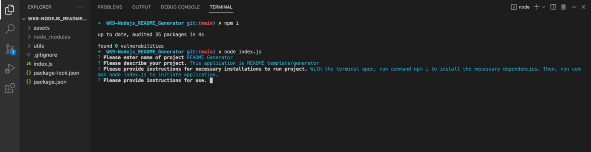

# README Generator
  
  ## Description

  This is a command-line application that dynamically generates a professional README.md file from a user's input using the Inquirer package

  ## Video Recording
  [WALK-THROUGH VIDEO](https://drive.google.com/drive/folders/1eBZAD336dVGj7XKMfhvl_BHAKF--iBR-?usp=sharing)

  ## Screenshots
  

  ## Table of Contents
  #### [Installation](#installation)
  #### [Usage](#usage)
  #### [Contribution](#contribution)
  #### [License](#license)
  #### [Contact](#questions)

  ## Installation

  With the terminal open, run command npm i to install the necessary dependencies. Then, run comman node index.js to initiate application.

  ## Usage

  You only need to answer the prompts.

  ## Contribution

  Submit a pull request

  ## License

   [MIT](https://choosealicense.com/licenses/mit/) Licensed

  ## Questions?

  Github: [fyerra](https://github.com/fyerra)
  E-mail: frankyerra1@gmail.com

